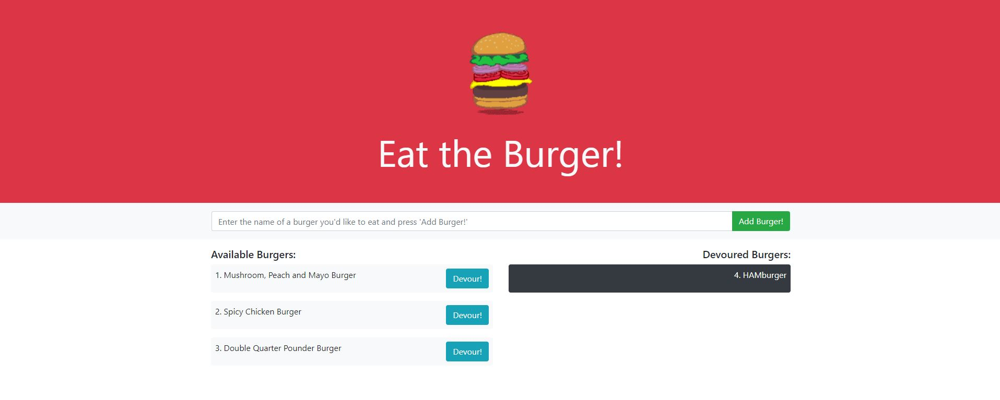
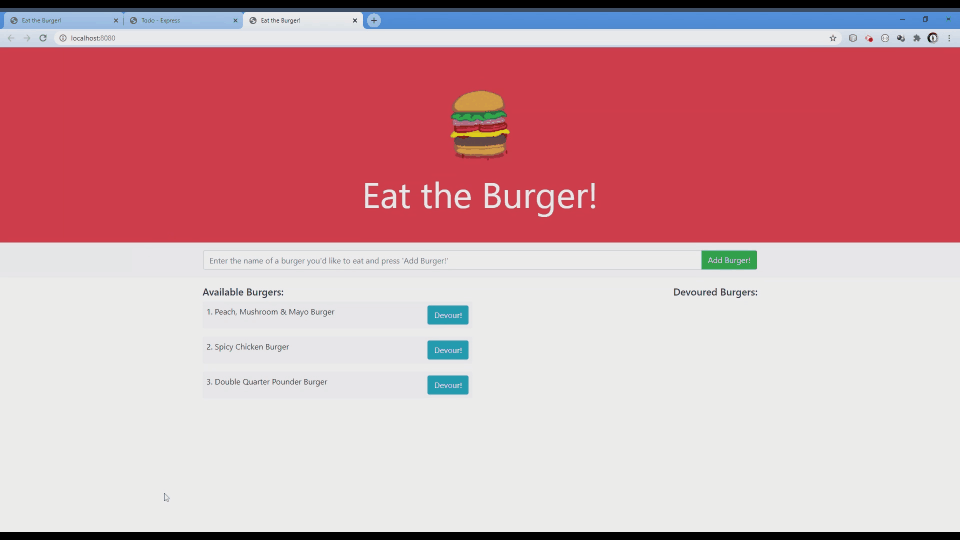

# Eat the Burger!

## Description 
  For this assignment, we created a burger logger with MySQL, Node, Express, Handlebars and a homemade ORM. We used Node and MySQL to query and route data on the app, and Handlebars to generate our HTML. This was then hosted on Heroku.

  

  

  ---
## Deployed Application
https://andrew-eats-burgers.herokuapp.com/
    

  ---
  ## Table of Contents

  * [Installation](#installation)
  * [Usage](#usage)
  * [License](#license)
  * [Questions](#questions)

  ---
  ## Installation 
  1. `git clone https://github.com/diemrbond/burger` 
  2. `npm install`

  
  ---
  ## Usage 
  1. In the burger directory, create a .env file
  2. Add your mysql password in the format `DB_PASS=YourPassword`
  3. Run the db/schema.sql and db/seeds.sql in Workbench or similar to create your local database. 
  4. Run `node server.js` to launch the server.
  5. Visit http://localhost:8080/

  OR

  1. Visit the deployed app on https://andrew-eats-burgers.herokuapp.com/

  ---
  ## License 
  This application is licensed under: GNU GPLv3
  
This program is free software: you can redistribute it and/or modify it under the terms of the GNU General Public License as published by the Free Software Foundation, either version 3 of the License, or (at your option) any later version.

This program is distributed in the hope that it will be useful, but WITHOUT ANY WARRANTY; without even the implied warranty of MERCHANTABILITY or FITNESS FOR A PARTICULAR PURPOSE. See the GNU General Public License for more details.

You should have received a copy of the GNU General Public License along with this program. If not, see <https://www.gnu.org/licenses/>.

  
  ---
  ## Questions
  If you have any questions about this project, please feel free to contact me via the following information:

  

  Andrew Kelleher

  Github: https://github.com/diemrbond

  Email: [mrbondmustdie@gmail.com](mailto:mrbondmustdie@gmail.com)

  ---
  © 2020 Andrew Kelleher | diemrbond.github.io

